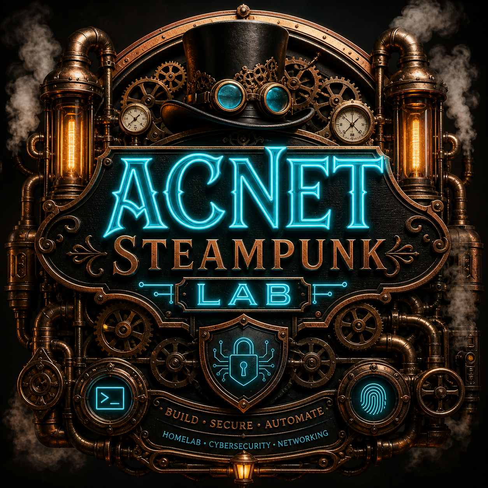
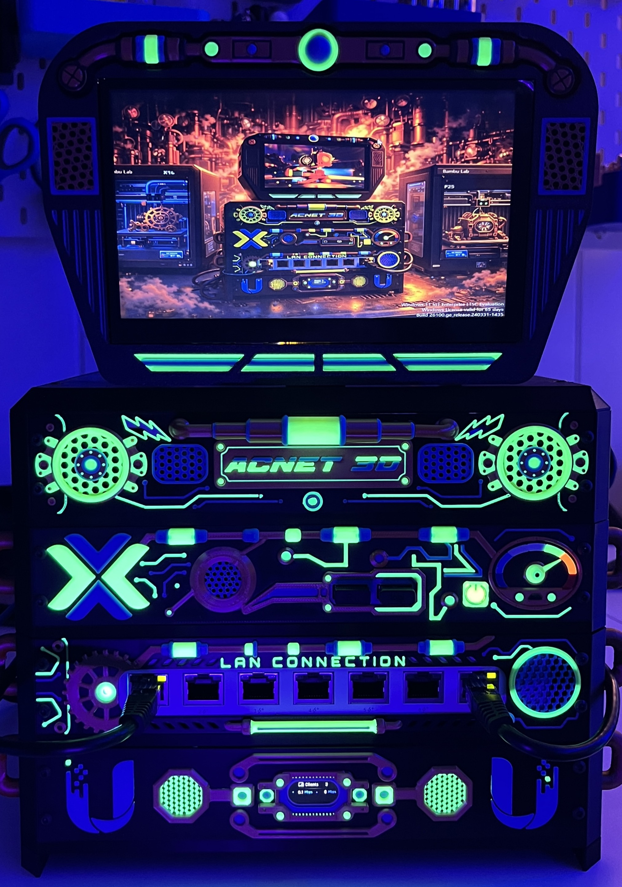
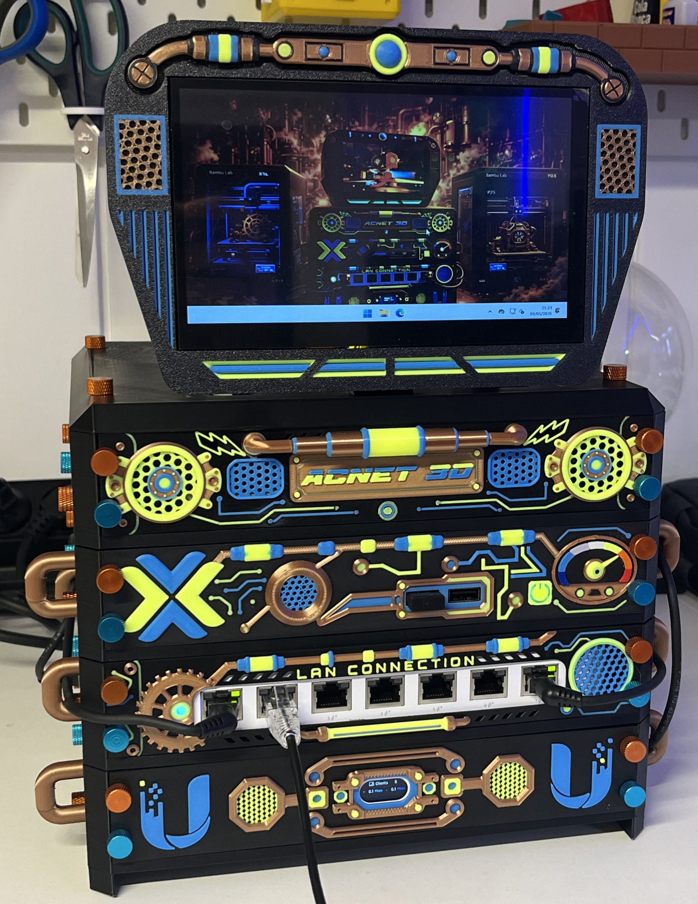
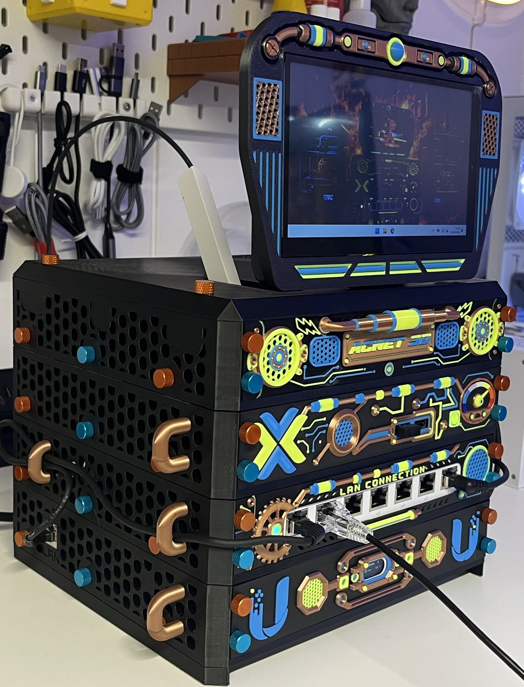
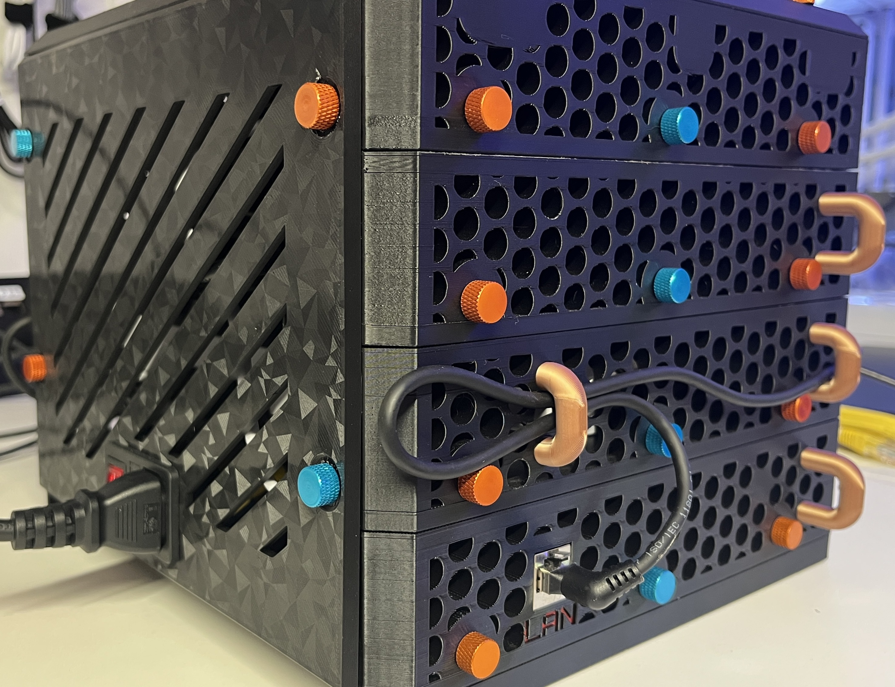
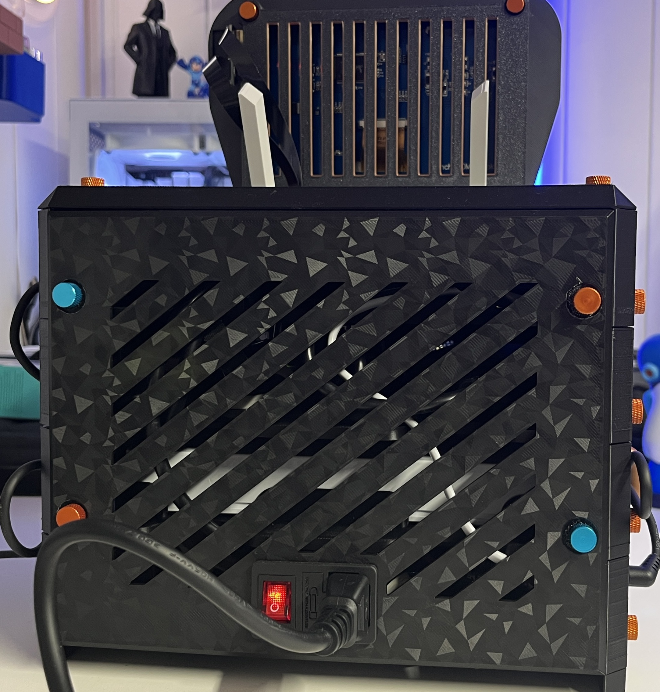
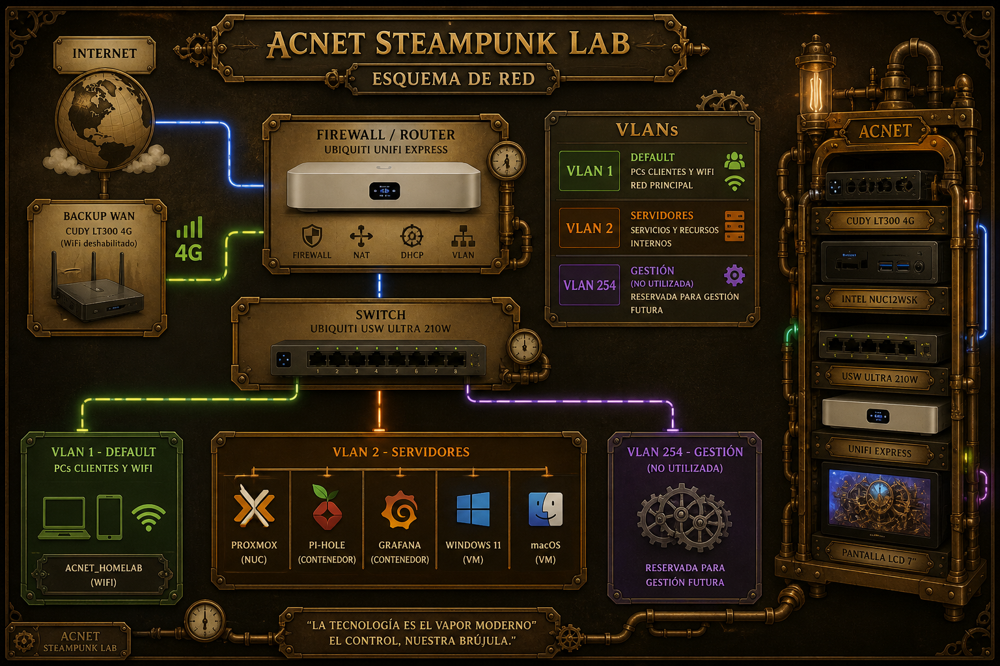

# ACNET Steampunk Lab

  

  

> *Homelab modular impreso en 3D que combina red, virtualización y control integrado en un diseño inspirado en el steampunk.*

---

## ⚡ Resumen rápido

- 🧱 Rack impreso en 3D totalmente personalizado  
- 🌐 Red segmentada con VLANs y WiFi  
- 🖥️ Virtualización con Proxmox  
- 🧠 Nodo de control integrado (pantalla + Windows)  
- 🚫 Bloqueo de publicidad con Pi-hole

---

## 🧠 Descripción

ACNET Steampunk Lab es un homelab compacto y completamente funcional, construido dentro de un rack diseñado e impreso en 3D, combinando infraestructura real con una estética steampunk.

Este proyecto integra red, virtualización y control local en una única unidad autónoma.

---

## 🔥 Características

* 🧱 Estructura **100% diseñada e impresa en 3D** (PETG + PLA)
* 🌐 Red segmentada con **VLANs y SSIDs**
* 🖥️ **Servidor Proxmox** con múltiples servicios
* 🧰 Nodo de **control integrado (Windows 11 + LCD)**
* 🎨 Diseño steampunk con **cobre, negro mate y colores neón**
* 🚫 Bloqueo de publicidad con **Pi-hole**

---

## 📸 Vista general

  
  
  

  
  

---

## 🏗️ Diseño e Impresión

* Diseñado en [**Onshape**](https://onshape.pro/sharehorizons)
* Desarrollo apoyado por la comunidad **[SHARE HORIZONS](https://sharehorizons.com/)**
* Impreso con:

  * [**Bambu Lab X1C**](https://bambulab.com/es/x1)
  * [**Bambu Lab P2S**](https://bambulab.com/es/p2s)

### Materiales y Colores:

* [**Negro PETG-HF Bambulab**](https://eu.store.bambulab.com/es/products/petg-hf?id=49068714590556) → base estructural (resistencia térmica)
* [**Cobre Winkle PLA Silk Winkle**](https://winkle.shop/producto/filamento-pla-silk-winkle-175-mm-0300-kg-cobre-antiguo/) → frontales y estética
* [**Amarillo neón PLA Silk Winkle**](https://winkle.shop/producto/filamento-pla-silk-winkle-175-mm-0300-kg-cobre-antiguo/) → frontales y estética
* [**Azul cian PLA Basic Bambulab**](https://eu.store.bambulab.com/es/products/pla-basic-filament) → frontales y estética

---

## 🧰 Hardware

De abajo a arriba:

* **Ubiquiti UniFi Express**
  * Firewall + punto de acceso WiFi 6
  * [Producto](https://www.amazon.es/Ubiquiti-Ue7-UbiQuiti-UX7/dp/B0F8B2XW8Q)

* **Ubiquiti USW Ultra 210W**
  * Switch gestionable de 8 puertos
  * [Producto](https://www.amazon.es/Ubiquiti-USW-LITE-8-POE-UbiQuiti/dp/B08MBRKG2Q/ref=sr_1_1?__mk_es_ES=%C3%85M%C3%85%C5%BD%C3%95%C3%91&crid=1JXRZR5U4HK3Y&dib=eyJ2IjoiMSJ9.Ki38Jr1tu2GKGsMs41UQ2bkczDgMY8E7Pj_Nfcjv7MSt2weCGILJd_fl_yiOUsFaJWcJdAQ2zH58hN26f33yPtTy-i2jdfjKoffDw7Sn7lYJmV3uOYn7ekdQ4trHqJ7nBR4XwG0VUXq7T7c-bxdbWGgZCPqjMrSMG_HCLf1cmZvT5IHBopE0KEf5dPW7nUwY294QWQ7w6cAeMldgB3fVUde6EISODgB3BrLJuhpLHD4c6wuOlEUDLj5dXRkIhjZudH6mR1HgiQ9gQx6Ktb28olkQprSaXZ_gDLIfWUufenw.PYSVzdFMfPImOun62rZ8gEmnsSD3nn3gxQZ7vZS8Y2s&dib_tag=se&keywords=unifi+usw+210&qid=1777835057&s=computers&sprefix=unifi+usw+210%2Ccomputers%2C81&sr=1-1&ufe=app_do%3Aamzn1.fos.4c3f56c3-e485-4a35-9abc-6532b61c3b62)

* **Intel NUC12WSK (i5-1240P)**

  * 32GB RAM
  * 1TB NVMe
  * [Soporte Intel](https://www.asus.com/es/supportonly/nuc12wsk/helpdesk_knowledge/)
  * Host de virtualización (Proxmox)

* **Cudy LT300 4G Router**

  * Conectividad LTE
  * WiFi deshabilitado (uso exclusivo como backup WAN)
  * [Ver producto](https://www.amazon.es/Cudy-LT300-Compatible-operadores-Configuraci%C3%B3n/dp/B0DD3WC9MB/ref=sr_1_7?__mk_es_ES=%C3%85M%C3%85%C5%BD%C3%95%C3%91&crid=12DA3TDQ7YK6I&dib=eyJ2IjoiMSJ9.TfF0MAqVnBqaPtJwWcjVfIIRZ2_fFFcRC8cyB7MQfF8GuoG3n4yXN3G7WZ-zAbgB5lBQ4cCi4s_XdrWj_KBQmnWAtfE1SVh_P3uG2jFO5n8uHKy0KVyGvR2O3RVH5TaMUqxFWj4C2U9wDGh7z0W-SA.2LE9A3RiFuKkv4qE-R9zrcf4tw2A9P9YEgL27M_pTFk&dib_tag=se&keywords=cuddy+4g&qid=1777833746&sprefix=cuddy+4%2Caps%2C128&sr=8-7)

* **Pantalla LCD 7”**
  
  * Conectada mediante adaptador USB → HDMI
  * Usada como interfaz local del sistema
  * [Ver producto](https://es.aliexpress.com/item/1005002570180532.html)

---

## ⚡ Consumo estimado

El consumo total del ACNET Steampunk Lab depende principalmente de la carga del NUC, el uso de la pantalla LCD y la actividad de red.

### 🔌 Consumo por dispositivo (estimado)

| Equipo                  | Consumo aprox. | Nota                            |
| ----------------------- | -------------: | ------------------------------- |
| UniFi Express           | hasta **10 W** | dato fabricante                 |
| USW Ultra 210W          |        **8 W** | sin dispositivos PoE conectados |
| Intel NUC12WSK i5-1240P |    **15–45 W** | según carga de CPU y VMs        |
| Cudy LT300 4G           |      **3–8 W** | 3 W idle / hasta 8 W            |
| Pantalla LCD 7”         |      **4–8 W** | estimación típica               |
| Adaptador USB-HDMI      |      **1–3 W** | estimación                      |

---

### 📊 Consumo total

| Escenario           | Consumo estimado |
| ------------------- | ---------------: |
| Reposo / uso ligero |      **35–45 W** |
| Uso normal          |      **45–65 W** |
| Pico de carga       |      **75–90 W** |

> Valores estimados. Pendiente de validación con medidor real.

---

## 🌐 Red

El ACNET Steampunk Lab está diseñado con una arquitectura de red segmentada mediante VLANs, permitiendo aislar dispositivos, servicios y futuras ampliaciones.

### 🧩 Esquema de red

  

---

### 🔌 Arquitectura

* **Firewall / Router**

  * Ubiquiti UniFi Express
  * Gestión de VLANs, NAT, DHCP y WiFi

* **Switch**

  * Ubiquiti USW Ultra 210W
  * Distribución de red cableada

* **Backup WAN**

  * Router 4G Cudy LT300
  * Conectividad secundaria (failover)

---

### 🧠 Segmentación por VLAN

* **VLAN 1 – Default**

  * Red principal
  * PCs cliente + WiFi (`ACNET_HOMELAB`)

* **VLAN 2 – Servidores**

  * Infraestructura interna
  * Proxmox, contenedores y máquinas virtuales

* **VLAN 254 – Gestión**

  * Reservada para administración futura
  * Actualmente no utilizada

---

### ⚙️ Funcionalidades

* Segmentación de red mediante VLANs
* Separación de tráfico cliente / servidor
* WiFi integrado en el firewall
* Bloqueo de publicidad mediante Pi-hole
* Arquitectura preparada para ampliaciones

---

## 🖥️ Servidor (Proxmox)

En el NUC:

* 🧱 **Pi-hole** (contenedor)
* 📊 **Grafana** (contenedor – en preparación)
* 🍏 **macOS VM**
* 🪟 **Windows 11**

  * Salida directa a la pantalla LCD
  * Nodo de control del sistema

---

## 🧪 Nodo de control integrado

El propio rack permite su gestión directa:

* Windows 11 conectado a:

  * Pantalla LCD
  * Teclado y ratón
* Control completo sin necesidad de otro equipo

---

## 🎓 Aprendizaje y comunidad

Proyecto desarrollado como parte de aprendizaje en:

* Diseño 3D (Onshape)
* Redes y segmentación
* Virtualización (Proxmox)

Con apoyo de:

👉 **[SHARE HORIZONS](https://sharehorizons.com/)**

---

## 🚀 Mejoras futuras

* Dashboards en Grafana
* Automatización
* Mejora de cableado
* Nueva versión del diseño

---

## 📍 Contexto

Proyecto presentado en la **3D Printer Party**.

